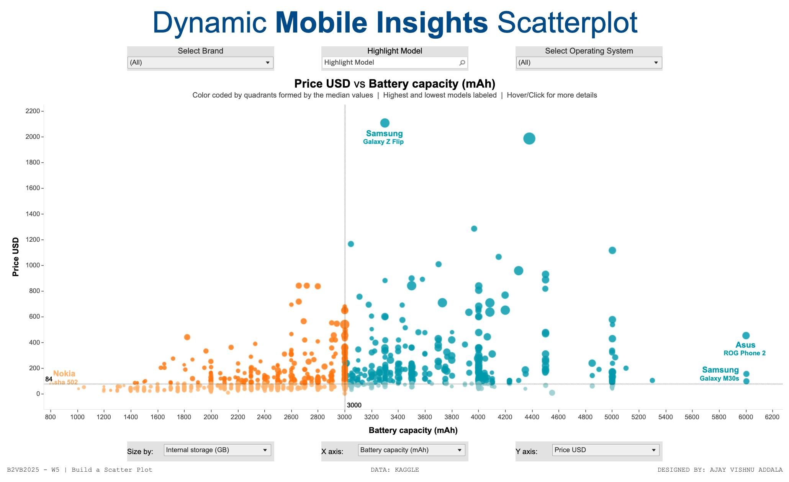

# Mobile Phone Specifications and Price Analysis

This project explores the relationship between various mobile phone specifications (such as RAM, battery capacity, camera resolution) and their prices. The interactive Tableau visualization allows users to analyze key features to help understand the trade-offs between performance and value.

---

## Features

- **Dynamic Analysis**: Compare key mobile phone specifications and prices.
- **Customizable Visualizations**: Explore insights by adjusting the axes and size parameters.
- **Interactive Insights**: Identify trends and outliers in mobile specifications and pricing.

---

## Data Source

The dataset used in this project is sourced from [Kaggle](https://www.kaggle.com/) and includes mobile phone specifications and prices compiled from the Gadget 360 website.

### Key Fields in the Dataset:
- **Battery Capacity** (mAh)
- **Screen Size** (inches)
- **RAM** (MB)
- **Internal Storage** (GB)
- **Camera Resolutions** (Front and Rear)
- **Operating System**
- **Price** (INR, USD, GBP)

---

## Snapshot of the Visualization

---

## Explore the Visualization

You can interact with the Tableau dashboard here: [View on Tableau Public](https://public.tableau.com/views/DynamicMobileInsightsScatterplotB2VB2025W5/B2VB2025W5?:language=en-US&:sid=&:redirect=auth&:display_count=n&:origin=viz_share_link)

---

